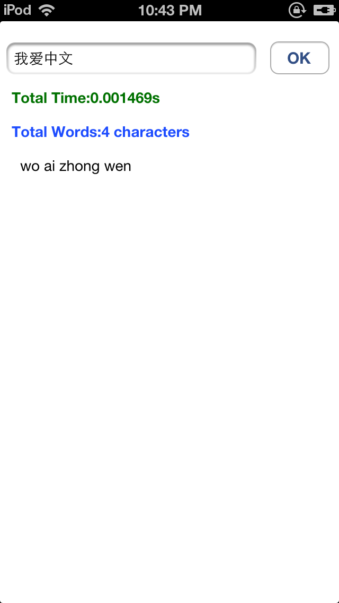

PinYin4Objc
===========

PinYin4Objc is a popular objective-c library supporting convertion between Chinese(both Simplified and Tranditional) characters and most popular Pinyin systems， it's performance is very efficient, data cached at first time, you can use async method with block, this can avoid ui blocking, and runs smoothly. The output format of pinyin could be customized. 

*update 

2013-10-08, V1.1, add async methods whit block, solve ui blcoking problems and fix some cache bugs;
2013-09-16, V1.0, firt virsion published.
  
* Usage
*  
 1.use async method with block, this can avoid ui blocking, and runs smoothly:
 
		NSString *sourceText=@"我爱中文";
    	HanyuPinyinOutputFormat *outputFormat=[[HanyuPinyinOutputFormat alloc] init];
    	[outputFormat setToneType:ToneTypeWithoutTone];
    	[outputFormat setVCharType:VCharTypeWithV];
    	[outputFormat setCaseType:CaseTypeLowercase];    
  		[PinyinHelper toHanyuPinyinStringWithNSString:sourceText 
  						   withHanyuPinyinOutputFormat:outputFormat 
  										   withNSString:@" " 
  										   outputBlock:^(NSString *pinYin) {
      		_outputTv.text=pinYin; //update ui

 		 }];
 		 
 2.use sync  method below:
 
		NSString *sourceText=@"我爱中文";
    	HanyuPinyinOutputFormat *outputFormat=[[HanyuPinyinOutputFormat alloc] init];
    	[outputFormat setToneType:ToneTypeWithoutTone];
    	[outputFormat setVCharType:VCharTypeWithV];
    	[outputFormat setCaseType:CaseTypeLowercase];
    	NSString *outputPinyin=[PinyinHelper toHanyuPinyinStringWithNSString:sourceText withHanyuPinyinOutputFormat:outputFormat withNSString:@" "];
    	
    	
    	
* ScreenShot

   